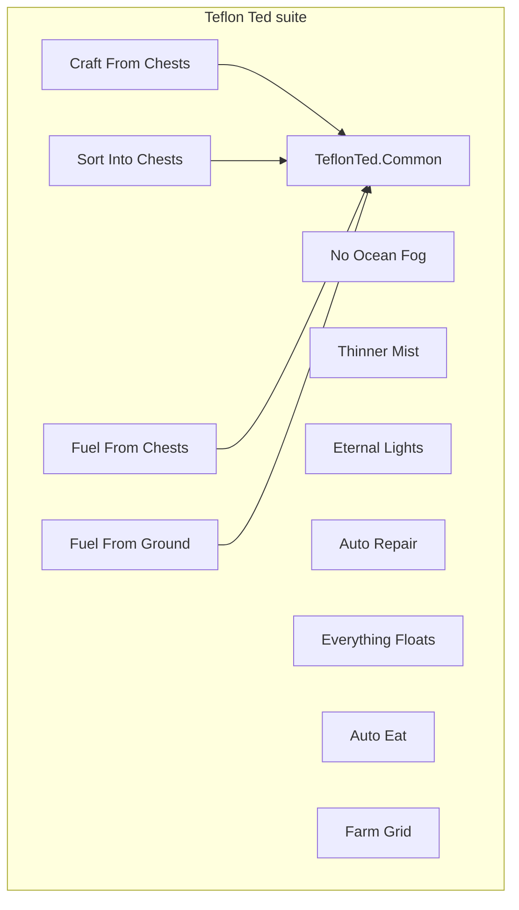

# Teflon Ted's Valheim Mod Suite

Single-purpose [BepInEx](https://thunderstore.io/c/valheim/p/denikson/BepInExPack_Valheim/) QoL mods for Valheim. Each plugin does **one** thing. Almost no config.



## Mods

| Mod | One-liner | Radius / trigger |
|-----|-----------|------------------|
| [Craft From Chests](mods/CraftFromChests) | Craft & build using materials in nearby chests | ~20 m around player |
| [Sort Into Chests](mods/SortIntoChests) | `` ` `` quick-stacks into chests that already hold that item | ~20 m; skips hotbar & equipped |
| [Fuel From Chests](mods/FuelFromChests) | Kilns / smelters / etc. pull fuel & ore from adjacent chests | ~4 m from intakes; auto + manual E |
| [Fuel From Ground](mods/FuelFromGround) | Same stations suck matching item drops off the ground | ~4 m; assembly-line friendly |
| [No Ocean Fog](mods/NoOceanFog) | Removes Misty whiteout weather (all biomes) | Always on |
| [Thinner Mist](mods/ThinnerMist) | Lighter Mistlands mist, slightly more visibility | Mistlands ParticleMist |
| [Eternal Lights](mods/EternalLights) | Fireplace lights never burn out | Always on |
| [Auto Repair](mods/AutoRepair) | Opening a station repairs all worn items it can repair | On station UI |
| [Everything Floats](mods/EverythingFloats) | Dropped items float on water | On item DB load |
| [Auto Eat](mods/AutoEat) | Re-eat the same food when its buff fully expires | On food tick |
| [Farm Grid](mods/FarmGrid) | Cultivator snaps plants to optimally spaced rows | Near existing plants |

Shared helpers: [`common/TeflonTed.Common`](common/TeflonTed.Common) (nearby containers, item drops, smelter intake math).

## Requirements

| Need | Notes |
|------|--------|
| Valheim (Windows) | Steam install |
| [BepInExPack Valheim](https://thunderstore.io/c/valheim/p/denikson/BepInExPack_Valheim/) | BepInEx 5, Doorstop |
| .NET SDK 6+ | Only if you build from source |

## Quick start (Windows)

1. Install BepInEx into your Valheim folder.
2. Copy `Environment.props.example` → `Environment.props` and set:

   ```xml
   <VALHEIM_INSTALL>C:\Program Files (x86)\Steam\steamapps\common\Valheim</VALHEIM_INSTALL>
   ```

3. Double-click [`Launch-Valheim.bat`](Launch-Valheim.bat) — builds, deploys to `BepInEx\plugins\TeflonTed.*`, starts the game.

```bat
Launch-Valheim.bat -SkipBuild
```

skips the build when you only want to play.

### Manual build

```bat
dotnet restore TeflonTed.Valheim.sln
dotnet build TeflonTed.Valheim.sln -c Release
```

Each plugin lands in `VALHEIM_INSTALL\BepInEx\plugins\TeflonTed.<ModName>\`. Chest/fuel mods also get `TeflonTed.Common.dll` in that folder.

### Drop-in install (no SDK)

Copy each `TeflonTed.*.dll` (and `TeflonTed.Common.dll` next to any chest/fuel mod) into `BepInEx\plugins\`.

## Design rules

- One job per mod
- Hardcoded radii / behavior (no kitchen-sink config)
- Branding: display name `Teflon Ted's …`, GUID `com.teflonted.valheim.<mod>`
- Client-side QoL for single-player / trusted friends

## Notes

- Game updates can rename Harmony targets — rebuild against the current `assembly_valheim.dll` if something stops loading.
- `BepInEx.AssemblyPublicizer.MSBuild` publicizes game assemblies at compile time; no manual publicizer step.
