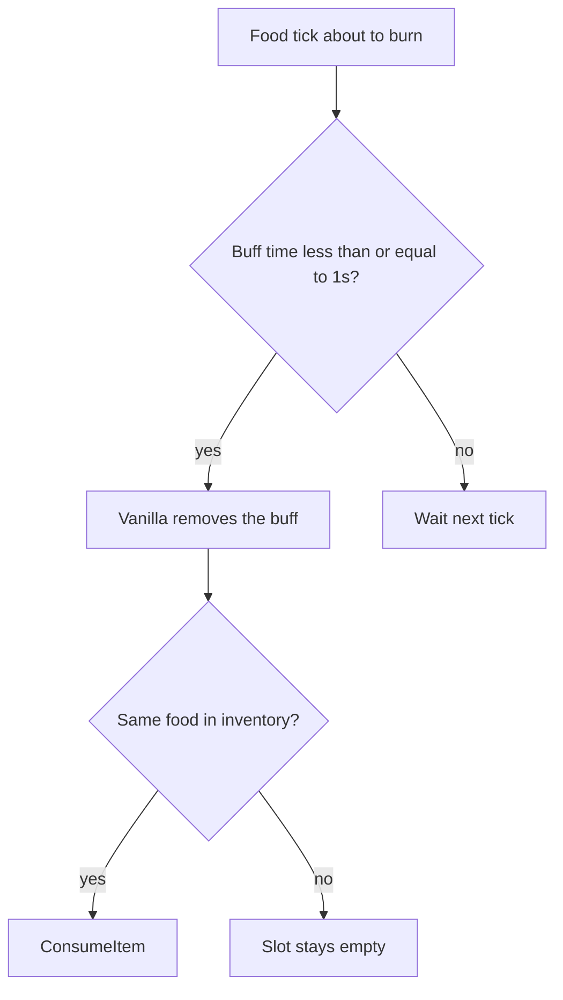

# Teflon Ted's Auto Eat

When a food buff’s timer hits zero, automatically eat **the same food** again if it is still in your inventory.

## Behavior

| Aspect | Detail |
|--------|--------|
| Trigger | Natural food tick (`Player.UpdateFood`, ~1 s food timer) |
| Match | Exact same shared item name as the buff that expired |
| Source | Player inventory only (not chests), including hotbar |
| Guards | Skips if dead, can’t eat, or nested re-entry from eating |

## Examples

| Active buffs | Inventory | When honey expires |
|--------------|-----------|--------------------|
| Honey, cooked meat, raspberry | 5× honey | Honey is re-eaten; others untouched |
| Honey only | No honey left | Buff ends; nothing eaten |
| Three foods | Stacks of each | Each refills independently as it expires |

## What it does **not** do

| Feature (kitchen-sink mods often add) | Here? |
|---------------------------------------|-------|
| Eat “best” food into empty slots | No |
| Re-eat before expiry / at 50% flash | No — only when fully expired |
| Harvest berries / mushrooms | No |
| Drink meads automatically | No |
| Pull food from chests | No |
| Config toggles / hotkeys | No |

Inspired by simpler auto-eat ideas in mods like Hunger Pangs / HungerPangsPlus, stripped to this one behavior.

## Tips

- Keep stacks of the foods you actually run (e.g. your usual three) in the bag or on the hotbar — both work. The original stack you ate from is preferred.
- Manually clearing a food icon does **not** trigger a refill (only timer expiry does).
