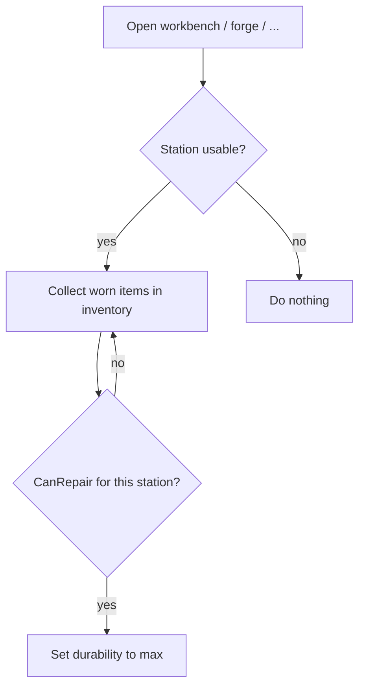

# Teflon Ted's Auto Repair

Open a crafting station and every **worn** inventory item that station can repair is fixed immediately — same rules as the vanilla repair hammer.

## Behavior

| Aspect | Detail |
|--------|--------|
| Trigger | Crafting station UI open (`InventoryGui.UpdateRepair`) |
| Items | All damaged items in inventory (`GetWornItems`), not only equipped |
| Eligibility | Vanilla `InventoryGui.CanRepair` |
| Station | Must allow repair (`m_canRepair`) and `CheckUsable` (e.g. forge needs fire) |

## Typical station coverage

| Station | Repairs (examples) | Needs |
|---------|-------------------|--------|
| Workbench | Wood weapons, leather armor, tools tied to workbench recipes | In range / level |
| Forge | Metal weapons & armor | Nearby fire |
| Stonecutter | Stone-tier pieces it owns | Usable station |
| Black forge / Galdr / Artisan | Whatever vanilla `CanRepair` allows for that station | Station-specific |

Modded stations participate if they hook the same repair API.

## What gets repaired vs not

| Item state | Repaired? |
|------------|-----------|
| Damaged, recipe belongs to this station | Yes |
| Full durability | Skipped |
| Damaged but wrong station (e.g. iron sword at workbench) | No |
| Station not usable (forge without fire) | Nothing |

## What it does **not** do

- Does not spend resources (vanilla repair is free at the station)
- Does not repair nearby buildings / wear-n-tear pieces
- Does not require clicking the repair button
