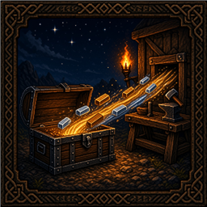

# Teflon Ted's Craft From Chests

> **One mod, one job** — no kitchen-sink configs or feature creep.

Developer notes for this mod. The Thunderstore / player-facing page lives in [`thunderstore/README.md`](thunderstore/README.md).

Craft and build using materials in nearby chests — not only your backpack.

## Behavior

| Aspect | Detail |
|--------|--------|
| When | Crafting, building, cooking, and consuming recipe materials |
| Where | Containers within **~20 m** of the player |
| What | Any item a recipe/piece requires |
| Order | Player inventory first, then chests |
| Access | Only chests you can open (guards / ownership respected) |
| UI | Requirement amount shows `need (chests)` — e.g. `10 (42)` |

## Which containers count?

Any player-accessible `Container` in range, including:

| Container | Notes |
|-----------|--------|
| Wood chest | `piece_chest_wood` |
| Reinforced chest | `piece_chest` |
| Black metal chest | `piece_chest_blackmetal` |
| Personal chest | If you have access |
| Cart / longship storage | If in range and accessible |
| Modded chests | If they use Valheim's `Container` |

Locked / ward-blocked chests you cannot open are skipped.

## What it applies to

| Action | Uses nearby chests? |
|--------|---------------------|
| Crafting station recipes | Yes |
| Building with the hammer | Yes |
| Cooking (cauldron, etc.) | Yes |
| Requirement row text | Yes — `need (in nearby chests)` |
| Enough-to-craft coloring | Yes (bag + chests) |
| Repair costs | Only if those paths check inventory the same way |

## What it does **not** do

- Does not pull from chests farther than ~20 m
- Does not open chests for you or move leftovers into storage
- Does not change recipes or unlock stations

## Stack with other mods

Works well with [Sort Into Chests](../SortIntoChests) (stash) and [Fuel From Chests](../FuelFromChests) (processing). Same ~20 m idea as sort; fuel mods use a much tighter ~4 m radius on purpose.
