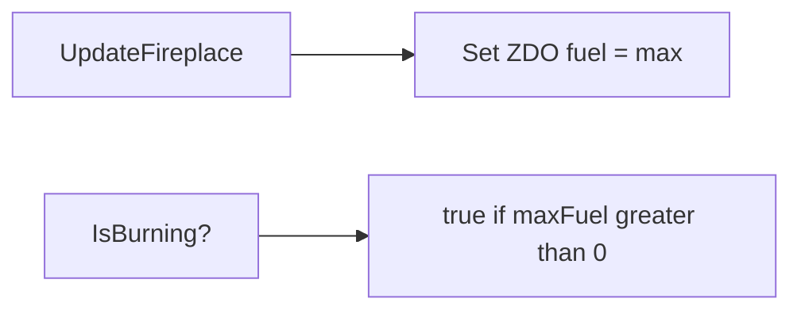

# Teflon Ted's Eternal Lights

Any **Fireplace**-based light stays fueled forever — no resin, wood, or coal babysitting.

## Behavior

| Aspect | Detail |
|--------|--------|
| Component | Valheim `Fireplace` |
| Fuel | Continuously forced to `m_maxFuel` on the owning client |
| Burning check | Pieces with `m_maxFuel > 0` always report as burning |

## Typical pieces covered

Anything using `Fireplace` with a fuel capacity, including:

| Piece (examples) | Usual vanilla fuel |
|------------------|--------------------|
| Campfire / hearth | Wood |
| Standing wood torch | Resin / similar |
| Standing iron torch | Resin / similar |
| Wall torch | Resin / similar |
| Brazier / blue brazier | Coal / resin variants |
| Other fireplace lights | Whatever that prefab defines |

Exact fuel types are irrelevant — the mod never consumes them.

## What it does **not** cover

| System | Why |
|--------|-----|
| Cooking station (cauldron station piece) | Different component |
| Smelter / kiln fuel | See [Fuel From Chests](../FuelFromChests) |
| Wisp lights / demisters | Often not standard `Fireplace` fuel burn |

If a light still goes out, it likely is not a fueled `Fireplace` (or another mod is fighting the fuel ZDO).

## What it does **not** do

- Does not add new light pieces
- Does not change light radius or color
- Does not auto-build or place torches
