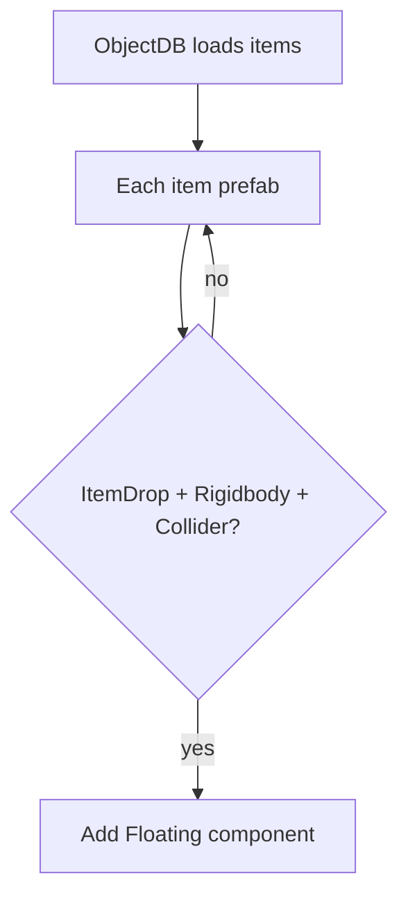

# Teflon Ted's Everything Floats

Dropped items get Valheim’s `Floating` component so they bob on water instead of sinking.

## Behavior

| Aspect | Detail |
|--------|--------|
| When | `ObjectDB.Awake` / `CopyOtherDB` (item prefabs load) |
| What | Every `ItemDrop` prefab with a `Rigidbody` + collider |
| How | Add/enable `Floating` with `m_waterLevelOffset = 0.7` |

## What floats

| Category | Examples |
|----------|----------|
| Resources | Wood, ore, scrap, coal, flax, barley |
| Gear | Weapons, armor, tools (as drops) |
| Consumables | Food, meads, trophies |
| Already-floating vanilla items | Left enabled |

Prefabs **without** a rigidbody/collider (non-world drops) are skipped.

## Water types

| Surface | Effect |
|---------|--------|
| Ocean / rivers / ponds | Float at waterline offset |
| Tar pits | Uses the same `Floating` behavior Valheim applies |

## What it does **not** do

- Does not stop items despawning on timers
- Does not auto-loot floating piles
- Does not change ship cargo or container physics
- Does not make the player float differently
