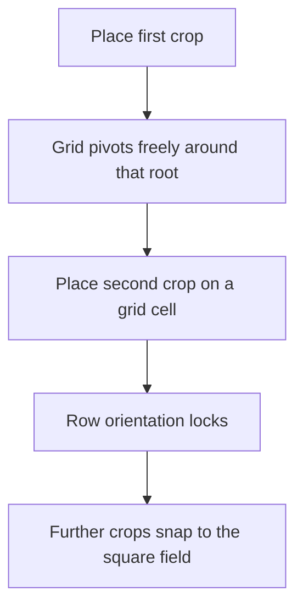

# Teflon Ted's Farm Grid

Snaps cultivator planting to a local grid so crops land in clean, optimally spaced rows — no more guessing “needs room to grow.”

Modeled on [Venture Farm Grid](https://github.com/OrianaVenture/VentureValheim/tree/master/FarmGrid) (Sarcen’s Farm Grid workflow).

## Behavior

| Aspect | Detail |
|--------|--------|
| Tool | Cultivator placement ghost |
| Cell size | `2 × m_growRadius + 0.05 m` per crop type |
| Snap origin | Plant root (same point vanilla uses for grow-space checks) |
| Visual | Green grid lines while placing near existing crops |
| Config | None |

## Workflow

| Step | What you do | What the grid does |
|------|-------------|--------------------|
| 1 | Plant any crop | Green grid appears; orientation follows the cursor around that root |
| 2 | Plant a second crop on a snapped cell | Direction locks to that row |
| 3 | Keep planting | Ghost snaps to empty cells on the square field |

Walk away from plants (or put the cultivator away) and the grid hides; start a new patch anytime with a fresh first plant.

## Spacing

| Rule | Why |
|------|-----|
| Cell = 2 × grow radius + 0.05 m | Matches vanilla “needs room to grow” (wiki minimum) plus a small collider/float margin |
| Per crop type | Flax, barley, carrots, etc. each use their own `m_growRadius` |
| Root position, not child colliders | Off-center colliders were shrinking flax rows and browning plants |

## Examples

| You’re planting | Nearby plants | Result |
|-----------------|---------------|--------|
| Flax | One flax | Ghost snaps ~1.05 m from that root; grid pivots freely |
| Flax | Two flax already on a row | Orientation locks; further flax fill the square |
| Carrot next to flax | Mixed radii | Cell uses the larger of ghost vs neighbor grow radius |
| Cultivator, no plants nearby | — | No grid; vanilla free placement |

## What it does **not** do

| Feature (other farm mods often add) | Here? |
|-------------------------------------|-------|
| Config toggles / custom spacing | No |
| Auto-plant / fill a whole field | No |
| Harvest / replant helpers | No |
| Force-grow or ignore biome rules | No |
| Snap when cultivator is not selected | No |

## Tips

- Replant any already-brown crops after updating — tight rows from older snaps won’t heal themselves.
- Lock the row with the **second** plant carefully; that sets the field angle for everything after.
- Works for vanilla crops and anything else that uses Valheim’s `Plant` + `m_growRadius`.
