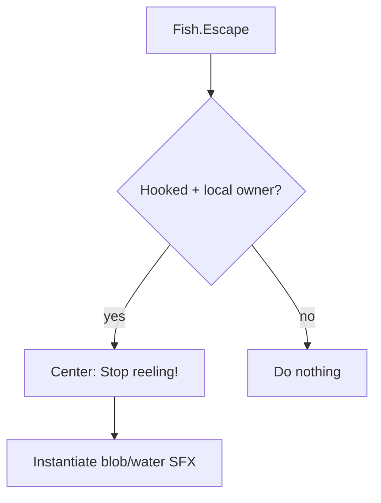

# Teflon Ted's Fighting Fish

When a hooked fish starts fighting (escape phase), flash **Stop reeling!** in the center of the screen and play a short watery SFX — vanilla only shows subtle thrashing and silent stamina spike.

## Behavior

| Aspect | Detail |
|--------|--------|
| Trigger | `Fish.Escape()` while hooked (hook start + each later fight cycle) |
| Who | Local player who owns the fishing float only |
| Message | Center HUD: `Stop reeling!` |
| Sound | `sfx_land_water`, then `sfx_blob_jump`, then `sfx_blob_land` |
| Config | None |

## Why these sounds

| Prefab | Why |
|--------|-----|
| **sfx_land_water** (default) | Clear water splash — reads as fish thrashing the surface |
| sfx_blob_jump | Wet blob plop fallback |
| sfx_blob_land | Similar blob splash fallback |

Other candidates if you want to fork the cue later: `sfx_blob_attack` (more aggressive), `sfx_ship_waterimpact` (heavier splash), `sfx_fishingrod_linebreak` (fishing-flavored but reads as failure).

## What it does **not** do

| Feature | Here? |
|---------|-------|
| Change stamina / reel speed / fish AI | No |
| Auto-stop reeling for you | No — cue only |
| Config / volume / custom message | No |
| Server requirement | No — client QoL |

## Tips

- Fight phases still alternate with idle; cue fires at the **start** of each fight, including the one right when you hook.
- Ease off block/reel while the message is up; reel again when the fish calms (no message).
