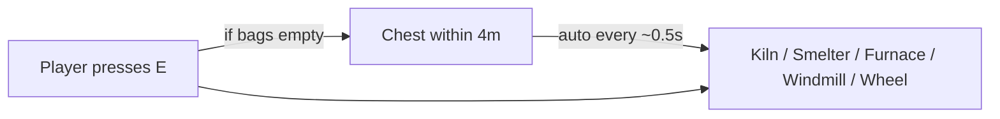

# Teflon Ted's Fuel From Chests

Processing stations pull **fuel** and **inputs** from chests within ~4 m of their intakes — automatically while running, and when you press **E** with empty hands.

## Range

| Setting | Value |
|---------|--------|
| Search radius | **~4 m** from each intake point |
| Intake points | Ore switch, fuel/wood switch, windmill hub, piece origin |
| Why so tight | Avoids draining a distant storage room |

## Structures (all use Valheim's `Smelter` component)

| Structure | Takes as fuel | Takes as input (“ore”) | Produces |
|-----------|---------------|-------------------------|----------|
| Charcoal kiln | — | **Plain wood only** (auto-feed never takes fine/core/…) | Coal |
| Smelter | Coal | Tin / copper / iron scrap / silver / … | Ingots |
| Blast furnace | Coal | Black metal scrap, flametal ore, … | Black metal / flametal |
| Windmill | — | Barley | Barley flour |
| Spinning wheel | — | Flax | Linen thread |

Exact accept lists come from each prefab’s `m_fuelItem` and `m_conversion` — anything vanilla (or a mod) wires into that station works, **except** kiln auto-feed skips premium woods (see below).

### Kiln wood (auto-feed)

| Item | Auto from chests / ground? | Manual hand insert? |
|------|----------------------------|---------------------|
| Wood (plain) | Yes | Yes |
| Fine wood | No | Yes (vanilla) |
| Core wood (`RoundLog`) | No | Yes (vanilla) |
| Ancient bark / yggdrasil / ashwood | No | Yes if the kiln accepts it |

### Common smelter / blast-furnace pairs

| Input | Fuel | Output (typical) |
|-------|------|------------------|
| Tin ore | Coal | Tin |
| Copper ore | Coal | Copper |
| Iron scrap | Coal | Iron |
| Silver ore | Coal | Silver |
| Black metal scrap | Coal | Black metal |
| Flametal ore | Coal | Flametal |

## Which chests?

| Container | Used? |
|-----------|--------|
| Any accessible chest / crate / cart hold in range | Yes |
| Ward-locked / no access | No |
| Chests only near the **intake**, not the whole base | By design |

## Manual E vs auto

| Mode | Behavior |
|------|----------|
| Auto (`UpdateSmelter`) | While the station has room, pull 1 matching item from a nearby chest every ~0.5 s |
| Manual E (empty bags) | Vanilla would refuse; this mod takes 1 from a nearby chest instead |
| Manual E (item in bags) | Vanilla path unchanged — inventory wins |

## Priority

1. Fill **fuel** room if the station uses fuel and a chest has it  
2. Else fill **input/ore** room from conversion list order  

## What it does **not** do

- Does not pull from ground drops ([Fuel From Ground](../FuelFromGround) does that)
- Does not empty finished products into chests
- Does not use the ~20 m craft radius
- Does not auto-feed fine wood, core wood, or other premium woods into kilns
