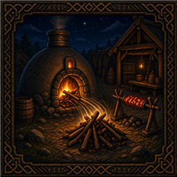

# Teflon Ted's Fuel From Ground

> **One mod, one job** — no kitchen-sink configs or feature creep.

Developer notes for this mod. The Thunderstore / player-facing page lives in [`thunderstore/README.md`](thunderstore/README.md).

Same processing stations as [Fuel From Chests](../FuelFromChests), but they suck matching **item drops** off the ground within ~4 m — for kiln → smelter style assembly lines.

## Range

| Setting | Value |
|---------|--------|
| Search radius | **~4 m** from station intakes |
| Source | `ItemDrop` pickups on the `item` layer |
| Rate | Up to **1 item per ~0.5 s** per station |

## Structures and matching drops

| Structure | Will pick up from ground | Becomes |
|-----------|--------------------------|---------|
| Charcoal kiln | **Plain wood only** (not fine/core/…) | Coal (queued as kiln input) |
| Smelter | Coal (fuel), ores / scrap (input) | Ingots |
| Blast furnace | Coal, black metal scrap, flametal ore, … | Alloys |
| Windmill | Barley | Barley flour |
| Spinning wheel | Flax | Linen thread |
| Frost Foundry | **Liquid Frost only** | Foundry fuel |

Acceptance uses the station's own fuel item + `IsItemAllowed` conversion list — same rules as inserting by hand, **except** kilns never auto-suck fine wood, core wood, or other premium woods (plain `Wood` only). Frost Foundry is Liquid Frost only so stone ovens never drain wood drops. Manual hand-loading is unchanged.

## Example assembly line

| Step | Setup |
|------|--------|
| 1 | Chest or wood drops beside kiln (~4 m) |
| 2 | Kiln produces coal onto the ground (or into a tight drop zone) |
| 3 | Smelter within ~4 m of that coal + ore supply |
| 4 | Optional: [Fuel From Chests](../FuelFromChests) for chest-fed ore/coal instead of floor piles |

## Stack vs chest mod

| Mod | Pulls from |
|-----|------------|
| Fuel From Chests | Containers |
| Fuel From Ground | World item drops |
| Both installed | Both — chests and floor |

## What it does **not** do

- Does not vacuum unrelated junk (wrong item types are ignored)
- Does not extend beyond ~4 m
- Does not auto-output finished bars into chests
- Does not pull wood into stone ovens / cooking stations (Frost Foundry Liquid Frost only)
