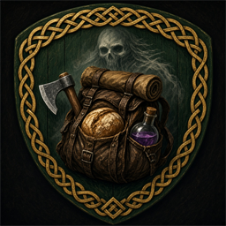

# Teflon Ted's No Drop Death

> **One mod, one job** — no kitchen-sink configs or feature creep.

Developer notes for this mod. The Thunderstore / player-facing page lives in [`thunderstore/README.md`](thunderstore/README.md).

Dying still places a tombstone and death map pin. Inventory is not moved into the grave (or deleted by death world keys).

## Behavior

| Aspect | Detail |
|--------|--------|
| Tombstone | Vanilla `CreateTombStone` still runs (empty grave) |
| Map pin | Vanilla death pin unchanged |
| Inventory | `MoveInventoryToGrave` skipped during tombstone create |
| Delete keys | `RemoveUnequipped` skipped during tombstone create |
| Skills | Unchanged (hard-death skill loss still applies) |
| Food | Unchanged (vanilla still clears food buffs on death) |
| Config | None |

## Lessons from [SafeDeath](https://thunderstore.io/c/valheim/p/Finland_Fjordors/SafeDeath/)

| Take | Skip |
|------|------|
| Target the inventory transfer, not the whole death flow | Skipping `CreateTombStone` (hides tombstone / skips pin side effects tied to that path) |
| Guard against death-delete world keys | Config toggles for food / skills |
| | Patching `HardDeath` / restoring `m_foods` |

Vanilla `GlobalKeys.DeathKeepInventory` skips tombstone creation entirely. This mod keeps the tombstone and only blocks the dump.

## What it does **not** do

| Feature | Here? |
|---------|-------|
| Disable death / god mode | No |
| Hide tombstone or death map pin | No |
| Skill retention / no hard death | No |
| Keep food buffs | No |
| Config | No |

## Tips

- Client-side: death inventory runs on the owning player client.
- Corpse runs are optional: the tombstone is empty.
