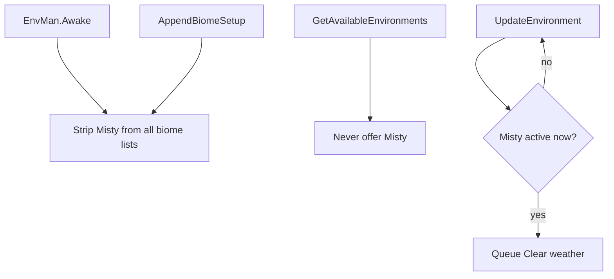

# Teflon Ted's No Ocean Fog

Removes **Misty** whiteout fog weather everywhere it can roll — Ocean, Plains, and any other biome that lists it. Does **not** remove Mistlands mist.

## What “Misty” is

| Concept | Detail |
|---------|--------|
| Weather id | `Misty` (dense white fog) |
| Common biomes | Ocean, Plains (also injectable elsewhere) |
| Not the same as | Mistlands volumetric mist / `ParticleMist` |

## Behavior

| Hook | Purpose |
|------|---------|
| `EnvMan.Awake` | Purge Misty from every biome’s weather pool |
| `EnvMan.AppendBiomeSetup` | Catch late ZoneSystem merges that re-add Misty |
| `EnvMan.GetAvailableEnvironments` | Filter Misty out of selection |
| `EnvMan.UpdateEnvironment` | If Misty is already playing, force `Clear` |

## What stays / what goes

| Effect | Removed? |
|--------|----------|
| Ocean / Plains Misty whiteout | Yes |
| Rain, thunder, clear skies | No |
| Mistlands mist | No |
| Ashlands ash / other env FX | No |

## What it does **not** do

- No density sliders or per-biome toggles
- Does not disable Mistlands gameplay mist
- Does not change wind or wave height by itself (only the Misty weather entry)
