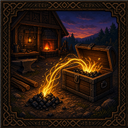

# Teflon Ted's Sort From Ground

> **One mod, one job** — no kitchen-sink configs or feature creep.

Developer notes for this mod. The Thunderstore / player-facing page lives in [`thunderstore/README.md`](thunderstore/README.md).

World item drops get sucked into nearby chests that **already contain** the same item — kiln coal spit → coal chest, loot piles → seeded storage, etc.

## Behavior

| Aspect | Detail |
|--------|--------|
| Trigger | `ItemDrop.SlowUpdate` (owner client) |
| Range | **~4 m** around the drop |
| Matching | Chest must already have at least one of that item |
| Settle | Waits **~1 s** after spawn before vacuuming |
| Rate | At most one try per drop every **~0.5 s** |
| Config | None |

## Example

| Setup | Result |
|-------|--------|
| Charcoal kiln spits coal | Coal pile appears |
| Chest within ~4 m already holds coal | Coal is vacuumed into that chest |
| No seeded coal chest nearby | Coal stays on the ground |

## Stack vs sibling mods

| Mod | Direction |
|-----|-----------|
| [Sort Into Chests](../SortIntoChests) | Player backpack → chests (`` ` `` hotkey, ~20 m) |
| **Sort From Ground** | World drops → chests (~4 m, automatic) |
| [Fuel From Ground](../FuelFromGround) | World drops → kiln / smelter / … |
| [Fuel From Chests](../FuelFromChests) | Chests → kiln / smelter / … |

If a drop is in range of both a seeded chest and a hungry smelter, either mod may win the race — place storage and stations deliberately.

## What it does **not** do

| Feature | Here? |
|---------|-------|
| Dump into empty chests | No — seeded only |
| Pull from chests into your bag | No |
| Player hotkey sort | No — see [Sort Into Chests](../SortIntoChests) |
| Feed processing stations | No — see [Fuel From Ground](../FuelFromGround) |
| Config / custom radius | No |
