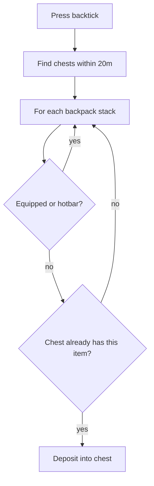

# Teflon Ted's Sort Into Chests

Press `` ` `` (backtick / tilde key) to shove backpack junk into nearby chests that **already contain** that item.

## Behavior

| Aspect | Detail |
|--------|--------|
| Hotkey | `` ` `` (`KeyCode.BackQuote`) |
| Range | **~20 m** around the player |
| Matching | Chest must already have at least one of that item |
| Remainder | Partial stacks fill existing stacks / free slots in matching chests |

## What moves / what stays

| Inventory slot | Sorted? |
|----------------|---------|
| Hotbar (grid row `y == 0`) | No |
| Equipped gear | No |
| Everything else in the bag | Yes, if a matching chest exists |

## Which containers count?

Same idea as craft-from-chests: accessible `Container` pieces in range.

| Container | Notes |
|-----------|--------|
| Wood / reinforced / black metal chests | Yes |
| Personal chest | If you have access |
| Cart / ship holds | If in range |
| Obliterator | Included on this hotkey (extra scan) — still only accepts items it already “matches” via normal deposit rules |

## Input ignored when

| UI | Why |
|----|-----|
| Console | Avoid typing `` ` `` into cheats |
| Chat focused | Same |
| Minimap open | Same |
| Text input / pause menu | Same |

Inventory can stay open; sorting still runs.

## What it does **not** do

- Does not dump into empty chests (no “first empty slot” fill)
- Does not touch hotbar or equipped items
- Does not pull from chests into your bag
