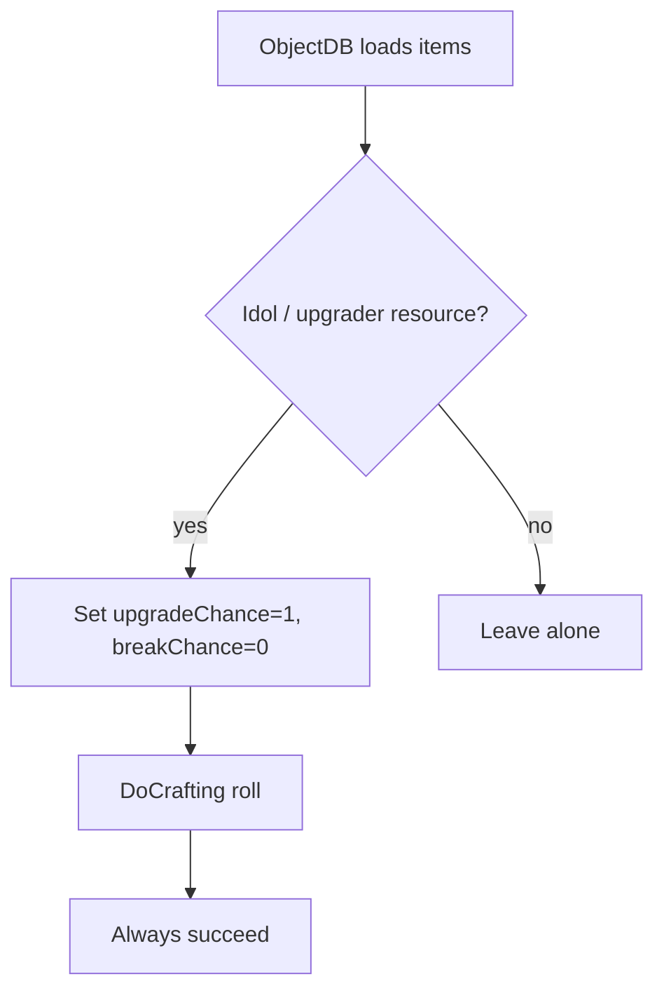

# Teflon Ted's Sure Potential

Forge of Potential (and any other upgrader station) always succeeds — no more 65% gamble, no broken gear.

## Behavior

| Aspect | Detail |
|--------|--------|
| Target | Item prefabs with `m_upgradeChance` / `m_breakChance` (idols) |
| Success | `m_upgradeChance = 1` (100%) |
| Break | `m_breakChance = 0` |
| When | `ObjectDB.Awake` / `CopyOtherDB` |
| Config | None |

## What it does **not** do

| Feature | Here? |
|---------|-------|
| Free upgrades / skip idol cost | No — still consumes the idol |
| Change upgrade duration or level caps | No |
| Normal forge / workbench / cauldron crafts | No |
| Config | No |

## Tips

- Client + server should both run this in multiplayer so everyone sees the same odds.
- Vanilla UI that shows success % will read 100% after idols load.
