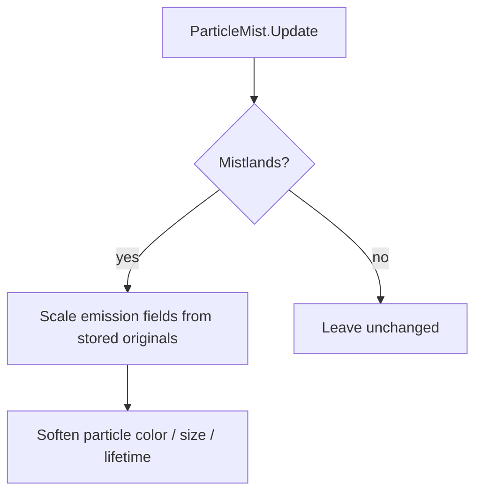

# Teflon Ted's Thinner Mist

Thins Mistlands volumetric mist and clears a bit more space near you — same idea as [Azumatt Foglands](https://thunderstore.io/c/valheim/p/Azumatt/Foglands/), without day/night veils, weather scaling, config, or demister gameplay changes.

## Behavior

| Aspect | Detail |
|--------|--------|
| Target | Mistlands `ParticleMist` only (`Heightmap.Biome.Mistlands`) |
| Thickness | Emission rates scaled to **40%** of vanilla |
| Visibility | `m_minDistance` × **1.35** (clearer pocket around the player) |
| Look | Soft gray particles, lower alpha, fewer max particles |
| Config | None |

## What changes vs vanilla

| Property | Effect |
|----------|--------|
| Local / distant emission | ~40% density |
| Distant thickness | ~40% |
| Min distance | +35% clear radius near player |
| Particle color | Neutral gray (`0.45 / 0.45 / 0.50`), alpha `0.25` |
| Max particles / lifetime | Cap 2000, lifetime 4s (lighter than vanilla) |

## What it does **not** do

| Feature (Foglands / MistBeGone often add) | Here? |
|-------------------------------------------|-------|
| Day/night fog cycle | No |
| Storm/rain multipliers | No |
| Toggle to remove all mist | No |
| Change `IsInMist` / demister detection | No — wisps still clear mist the same way |
| Ocean / Plains Misty whiteout weather | No — use [No Ocean Fog](../NoOceanFog) for that |
| Config / server sync | No |

## Tips

- Client-side visual tweak; everyone who wants the thinner mist should run the mod.
- Stacks fine with [No Ocean Fog](../NoOceanFog) — that strips Misty weather, this only touches Mistlands particles.
- Inspired by Azumatt’s Foglands daytime defaults, fixed in place with no knobs.
